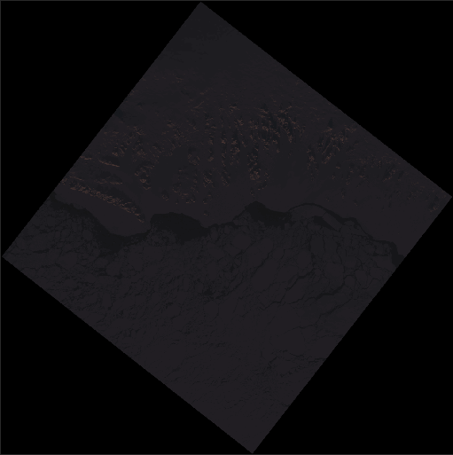
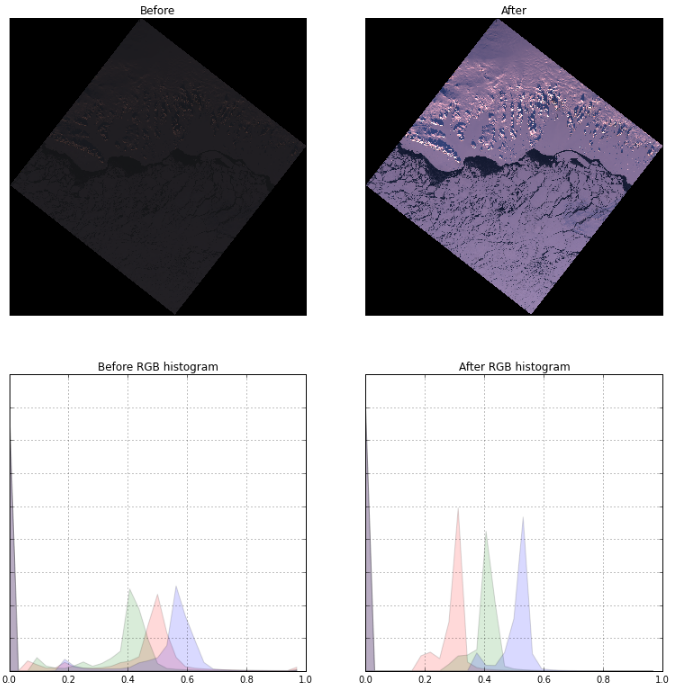
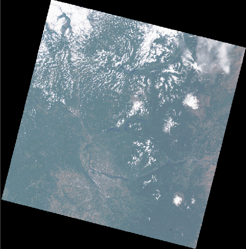
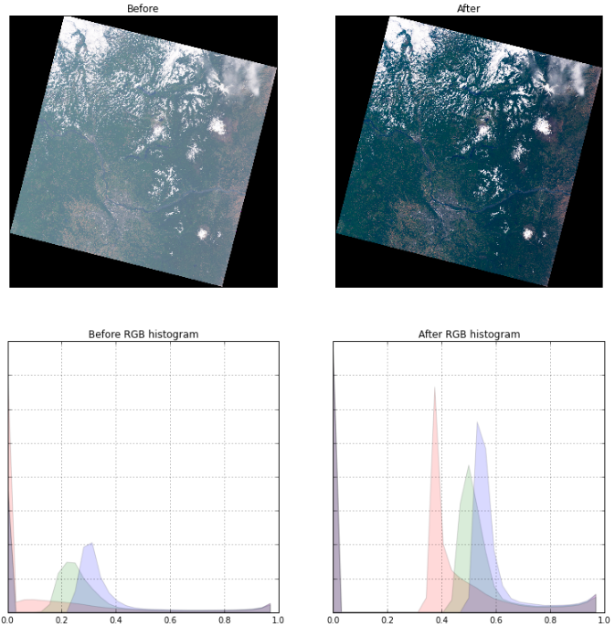
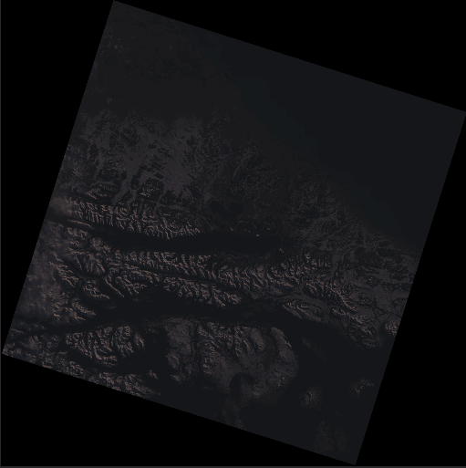
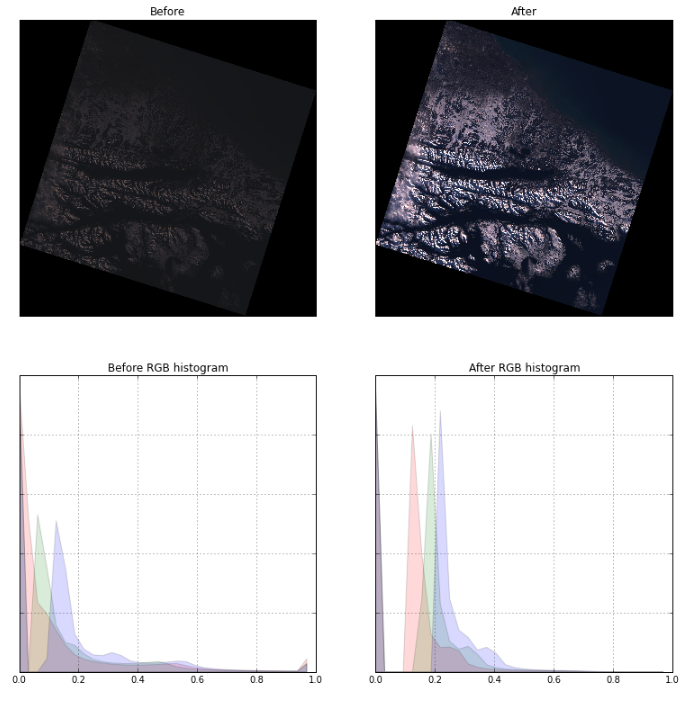

# rio-toa
[](https://travis-ci.org/mapbox/rio-toa)
[](https://coveralls.io/github/mapbox/rio-toa?branch=the-sunangle-also-rises)

Top Of Atmosphere (TOA) calculations for Landsat 8

## Before/After
##### Savissivik, Greenland 2016-02-29

###### Pre-TOA vs Post-TOA Histograms

##### Portland OR, USA 2016-06-25

###### Pre-TOA vs Post-TOA Histograms

##### Cape Horn, Argentina 2015-08-07

###### Pre-TOA vs Post-TOA Histograms


## Install

We highly recommend installing in a virtualenv. Once activated,
```
pip install -U pip
pip install rio-toa
```
Or install from source
```
git clone https://github.com/mapbox/rio-toa.git
cd rio-toa
pip install -U pip
pip install -r requirements-dev.txt
pip install -e .
```
## Python API
### `rio_toa.radiance`
The `radiance` module calculates top of atmosphere radiance of Landsat 8 as outlined here: http://landsat.usgs.gov/Landsat8_Using_Product.php.

#### 1. `radiance`
The `radiance.randiance` function accepts the following as inputs:  

- numpy 2D array (single band)  
- ML (multiplicative rescaling factor from scene mtl)  
- AL (additive rescaling factor from scene mtl)

and outputs:
- numpy 2D array (single band)

```
>>> from rio_toa import radiance
>>> from rio_toa import toa_utils
...
>>> toa = radiance.radiance(tif, ML, AL, src_nodata=0)
>>> toa_rescaled = toa_utils.rescale(toa, rescale_factor, dst_dtype)

```
#### 2.`calculate_landsat_radiance`
```
>>> from rio_toa import reflectance
...
>>> radiance.calculate_landsat_radiance(src_path, src_mtl, dst_path,
      creation_options, band_number, dst_dtype, processes)
```

======
### `rio_toa.reflectance`
The `reflectance` module calculates top of atmosphere reflectance of Landsat 8 as outlined here: http://landsat.usgs.gov/Landsat8_Using_Product.php.

#### 1. `reflectance`
The `reflectance.reflectance` function accepts the following as inputs:
- numpy ndarray
- MR (multiplicative rescaling factor from scene mtl), numpy ndarray
- AR (additive rescaling factor from scene mtl), numpy ndarray
- E (sun elevation angle from mtl or per pixel), numpy ndarray

and outputs:
- numpy ndarray

```
>>> from rio_toa import reflectance
>>> from rio_toa import toa_utils
...
>>> toa = reflectance.reflectance(img, MR, AR, E, src_nodata=0)
>>> toa_rescaled = toa_utils.rescale(toa, rescale_factor, dst_dtype)
```

#### 2. `calculate_landsat_reflectance`
```
>>> from rio_toa import reflectance
...
>>> reflectance.calculate_landsat_reflectance(list(src_paths), src_mtl, dst_path,
      rescale_factor, creation_options, list(band_numbers),
      dst_dtype, processes, pixel_sunangle)
```
- per pixel solar angles could be used instead of the scene center solar angle:
This option requires the additional ['DATE_ACQUIRED'] and ['SCENE_CENTER_TIME'] from mtl files.

```
>>> from rio_toa import reflectance
>>> from rio_toa import sun_utils
>>> import riomucho
>>> from rasterio import warp
>>> from rasterio.coords import BoundingBox
...
>>> date_collected = mtl['L1_METADATA_FILE']['PRODUCT_METADATA']['DATE_ACQUIRED']
>>> time_collected_utc = mtl['L1_METADATA_FILE']['PRODUCT_METADATA']['SCENE_CENTER_TIME']
>>> bboxes = [BoundingBox(
                *warp.transform_bounds(
                  src_crs',
                  {'init': u'epsg:4326'},
                  *open_files[i].window_bounds(window)))
              for i in range(data.shape[0])]
>>> E_stack = riomucho.utils.array_stack(
                [sun_utils.sun_elevation(
                  bbox,
                  data.shape[1:],
                  'date_collected',
                  'time_collected_utc')[np.newaxis, :]
                for bbox in bboxes])
...
>>> output = toa_utils.rescale(reflectance(
                    data,
                    M_stack,
                    A_stack,
                    E_stack,
                    'src_nodata'),
                  rescale_factor, dst_dtype)
```
### `rio_toa.brightness_temp`
The 'brightness_temp' module converts Landsat 8 TIRS band data from spectral radiance to brightness temperature as outlined here: http://landsat.usgs.gov/Landsat8_Using_Product.php.


#### 1. `brightness_temp`
The `brightness_temp.brightness_temp` function accepts the following as inputs:

- numpy 2D array (single band)
- ML (multiplicative rescaling factor from scene mtl)
- AL (additive rescaling factor from scene mtl)
- K1 (thermal conversion constant from the scene mtl)
- K2 (thermal conversion constant from the scene mtl)

and outputs:
- numpy 2D array (single band)

```
>>> from rio_toa import brightness_temp
>>> from rio_toa import toa_utils
...
>>> bt = radiance.radiance(tif, ML, AL, K1, K2, src_nodata=0)
>>> bt_rescaled= toa_utils.temp_rescale(toa, temp_scale)
```
#### 2.`calculate_landsat_brightness_temperature`
```
>>> from rio_toa import brightness_temp
...
>>> brightness_temp.calculate_landsat_brightness_temperature(src_path, src_mtl,
                                              dst_path, temp_scale,
                                              creation_options, thermal_bidx,
                                              dst_dtype, processes)

```

## `CLI`

### `radiance`

```
Usage: rio toa radiance [OPTIONS] SRC_PATH SRC_MTL DST_PATH

  Calculates Landsat8 Top of Atmosphere Radiance

Options:
  --dst-dtype            Output datatype. Default='float32'
                         ['float32', 'float64', 'uint16', 'uint8']
  -r, --rescale-factor   Rescale post-TOA tifs to 55,000.
                         Default=float(55000.0/2**16). 
                         Range: [float(55000.0/2**16), float(1.0)]
  -t, --readtemplate     File path template. Default='.*/LC8.*\_B{b}.TIF'
  -j, --workers INTEGER
  -t, --readtemplate     File path template. Default='.*/LC8.*\_B{b}.TIF'
  --l8-bidx INTEGER      L8 Band that the src_path represents (Default is
                         parsed from file name)
  -v, --verbose
  --co NAME=VALUE        Driver specific creation options.See the
                         documentation for the selected output driver for more
                         information.
  --help                 Show this message and exit.
```

### `reflectance`

```
Usage: rio toa reflectance [OPTIONS] SRC_PATH SRC_MTL DST_PATH

  Calculates Landsat8 Top of Atmosphere Reflectance

Options:


  --dst-dtype            Output datatype. Default='float32'
                         ['float32', 'float64', 'uint16', 'uint8']
  -r, --rescale-factor   Rescale post-TOA tifs to 55,000.
                         Default=float(55000.0/2**16). 
                         Range: [float(55000.0/2**16), float(1.0)]
  -t, --readtemplate     File path template. Default='.*/LC8.*\_B{b}.TIF'
  -j, --workers INTEGER  number of processes
  --l8-bidx INTEGER      L8 Band that the src_path represents (default is
                         parsed from file name)
  -v, --verbose          Debugging mode
  -p, --pixel-sunangle   Per pixel sun elevation
  --co NAME=VALUE        Driver specific creation options.See the
                         documentation for the selected output driver for more
                         information.
  --help                 Show this message and exit.
```


### `brighttemp`

```
Usage: rio toa brighttemp [OPTIONS] SRC_PATH SRC_MTL DST_PATH

  Calculates Landsat8 at-satellite brightness temperature TIRS band data can
  be converted from spectral radiance to brightness temperature using the
  thermal constants provided in the metadata file:

Options:
  -d, --dst-dtype [float32|float64|uint16|uint8]
                                  Output data type
  -s, --temp_scale [K|F|C]        Temperature scale [Default = K (Kelvin)]
  -t, --readtemplate TEXT         File path template [Default
                                  ='.*/LC8.*\_B{b}.TIF']
  -j, --workers INTEGER
  --thermal-bidx INTEGER          L8 thermal band that the src_path
                                  represents(Default is parsed from file name)
  -v, --verbose
  --co NAME=VALUE                 Driver specific creation options.See the
                                  documentation for the selected output driver
                                  for more information.
  --help                          Show this message and exit.
```

### `parsemtl`

Takes a file or stdin MTL in txt format, and outputs a json-formatted MTL to stdout

```
Usage: rio toa parsemtl [OPTIONS] [MTL]

  Converts a Landsat 8 text MTL to JSON

Options:
  --help  Show this message and exit.
```
From a local `*_MTL.txt`:
```
rio toa parsemtl tests/data/LC81060712016134LGN00_MTL.txt
```
From stdin:
```
cat tests/data/LC81060712016134LGN00_MTL.txt | rio toa parsemtl
```
From stdin on `s3`:
```
aws s3 cp s3://landsat-pds/L8/106/071/LC81060712016134LGN00/LC81060712016134LGN00_MTL.txt - | rio toa parsemtl
```
